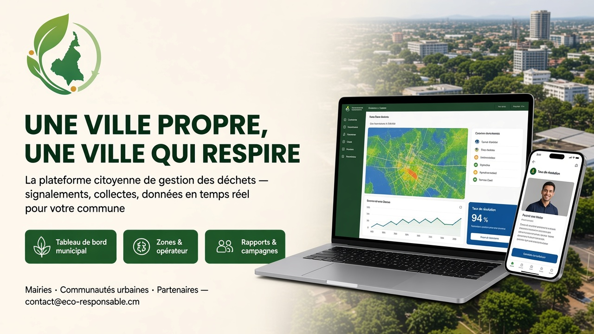

# Éco-Responsable

Plateforme citoyenne de gestion des déchets pour le Cameroun : signalement de
décharges sauvages, collecte à domicile payée en Mobile Money, tri incitatif
avec points et récompenses, application collecteur, back-office municipal et
back-office des entreprises de collecte.



Monorepo Flutter branché sur **Appwrite Cloud** — endpoint
`https://fra.cloud.appwrite.io/v1`, projet `eco-responsable-cm`.

| | |
|---|---|
| Flutter / Dart | 3.47.1 stable / SDK ^3.13 |
| Backend | Appwrite Cloud (région `fra`), SDK Dart `appwrite ^26.2` (API TablesDB) |
| État | Riverpod 3 · Navigation go_router 18 · Cartes flutter_map 8 · Graphiques fl_chart |
| Design | Planches dans [`docs/design/`](docs/design/) · thème `shared/lib/core/theme/` |
| Marketing | Affiches et visuels dans [`docs/marketing/`](docs/marketing/) |
| CI | [`.github/workflows/ci.yml`](.github/workflows/ci.yml) — un workflow, 5 sous-workflows |

---

## Sommaire

1. [Organisation du dépôt](#1-organisation-du-dépôt)
2. [Fonctionnalités par profil](#2-fonctionnalités-par-profil)
3. [Démarrage rapide](#3-démarrage-rapide)
4. [Authentification](#4-authentification)
5. [Configuration Appwrite](#5-configuration-appwrite)
6. [Architecture du code partagé](#6-architecture-du-code-partagé)
7. [Design system, icônes et visuels](#7-design-system-icônes-et-visuels)
8. [Backend : schéma, outils, état](#8-backend--schéma-outils-état)
9. [Intégration continue et livraison](#9-intégration-continue-et-livraison)
10. [Tests et qualité](#10-tests-et-qualité)
11. [Feuille de route](#11-feuille-de-route)

---

## 1. Organisation du dépôt

```
ECo/
├── shared/      package Dart `eco_core` : TOUT le code métier et les écrans
│   ├── lib/     core (appwrite, router, theme, widgets), features, shared/models, l10n
│   ├── assets/  images de l'app + branding (icônes d'application)
│   └── test/
├── mobile/      app Android / iOS  → citoyens et collecteurs          (AppTarget.mobile)
├── desktop/     app Linux / Windows / macOS → mairie + entreprises    (AppTarget.desktop)
├── web/         app web → tous les espaces, mise en page adaptative    (AppTarget.web)
├── appwrite/    documentation du schéma backend
├── appwrite.config.json   schéma déclaratif (généré par tool/gen_appwrite_config.py)
├── tool/        scripts Appwrite (CLI, curl, génération du schéma)
├── docs/design/     planches de référence + sources des visuels
└── docs/marketing/  affiches publicitaires, bannière, post réseaux sociaux
```

Chaque app (`mobile/`, `desktop/`, `web/`) ne contient qu'un `main.dart` de
trois lignes, sa configuration native et ses icônes ; elle dépend de
`eco_core` par chemin (`path: ../shared`). La **cible** (`AppTarget`) est
injectée au démarrage et pilote :

| Cible | Espaces exposés | Accueil après connexion |
|---|---|---|
| `mobile` | citoyen, collecteur | `/home` ou `/collector` ; admin/opérateur redirigés vers `/home` |
| `desktop` | mairie (`/admin`), entreprise de collecte (`/company`) | citoyen / collecteur → écran `/restricted` |
| `web` | tous | selon le rôle |

---

## 2. Fonctionnalités par profil

### Citoyen (mobile, web) — planches 1, 2, 3, 7

| Écran | Contenu |
|---|---|
| Onboarding 3 slides → inscription | Téléphone + **code à 6 chiffres choisi par l'utilisateur** (ou email + mot de passe), choix de la ville |
| Accueil | Impact réel (points, kg valorisés, CO₂ évité via `myImpactProvider`), objectif mensuel, raccourcis, 3 dernières notifications, badges |
| Signaler une décharge | Photo (caméra / galerie / fichier), géolocalisation, catégorie, urgence → `waste_reports` + bucket `report_photos` ; file hors ligne |
| Détail d'un signalement | Photo, carte, chronologie de statut temps réel, opérateur affecté |
| Demander une collecte | Type, volume, créneau, récurrence, position GPS, paiement MTN MoMo / Orange Money / Afriland → `collection_requests` |
| Suivi d'une demande | Collecteur assigné (nom, téléphone, appel direct), ETA, stepper de statut Realtime, paiement |
| Carte | Signalements et points de collecte autour de soi (OSM) |
| Récompenses | Solde, niveaux Bronze / Argent / Or, catalogue `reward_items`, échange (Function ou débit direct) |
| Notifications | Fil filtrable (toutes / non lues / collectes / points / alertes), marquage lu, navigation contextuelle |
| Profil, historique, paramètres | KPIs réels, langue, notifications, changement du code à 6 chiffres, déconnexion |

### Collecteur (mobile, web) — planches 5, 6

Accueil avec disponibilité en ligne / hors ligne et demandes en attente à
proximité, acceptation d'une demande, tournée du jour (carte + itinéraire,
arrêts numérotés), détail d'un arrêt (appel, navigation), confirmation avec
photo de preuve (`collection_proofs`) et poids réel → points crédités au
citoyen et notification, historique des interventions, revenus (graphique
hebdomadaire, cumul, versement Mobile Money).

### Mairie — back-office (desktop, web) — planche 4

| Écran | Contenu |
|---|---|
| Tableau de bord | Taux de résolution, délai moyen d'intervention, volume collecté, signalements ouverts ; carte de chaleur des signalements ; courbe créés / résolus sur 30 jours ; répartition par type de déchet |
| Gestion des signalements | Tableau filtrable (recherche, statut, urgence), détail latéral, **affectation d'un opérateur**, prise en charge, résolution, réouverture, export CSV |
| Zones et opérateurs | Carte des zones, création / édition de zone (quartier, fréquence, couleur, centre), affectation d'opérateurs par zone, liste des opérateurs partenaires |
| Rapports et communication | Rapports général / par zone / par opérateur / signalements (Function `generateAdminReport` puis repli CSV), **campagnes citoyennes** déposées dans les notifications in-app (toute la commune ou un quartier) |
| Paramètres | Profil, organisation, bascule de rôle, connexion Appwrite |

### Entreprise de collecte — back-office (desktop, web)

Tableau de bord (demandes en attente, collectes en cours, volume, revenus du
mois, graphique), **dispatch** des demandes vers les collecteurs de la flotte,
gestion de la flotte (ajout / édition de collecteurs, disponibilité), revenus
et versements.

---

## 3. Démarrage rapide

Prérequis : Flutter 3.47 stable ; Android : JDK 21 ; Linux :
`clang cmake ninja-build pkg-config libgtk-3-dev libsecret-1-dev libwebkit2gtk-4.1-dev`.

```bash
git clone https://github.com/Archlord12345/Eco-respo.git
cd Eco-respo

# Les identifiants projet passent en --dart-define (valeurs par défaut identiques).
DEFINES="--dart-define=APPWRITE_ENDPOINT=https://fra.cloud.appwrite.io/v1 \
         --dart-define=APPWRITE_PROJECT_ID=eco-responsable-cm"

(cd mobile  && flutter pub get && flutter run -d android $DEFINES)   # paquet com.eco.kf
(cd desktop && flutter pub get && flutter run -d linux   $DEFINES)   # ou windows / macos
(cd web     && flutter pub get && flutter run -d chrome  $DEFINES)
```

Builds release :

```bash
(cd mobile  && flutter build apk --release && flutter build appbundle --release)
(cd mobile  && flutter build ios --release --no-codesign)
(cd desktop && flutter build linux --release)      # build/linux/x64/release/bundle/
(cd desktop && flutter build windows --release)
(cd desktop && flutter build macos --release)
(cd web     && flutter build web --release)        # build/web/ → hébergeur statique
```

Régénérer les icônes d'application après modification de
`shared/assets/branding/app_icon.png` :

```bash
for a in mobile desktop web; do (cd $a && dart run flutter_launcher_icons); done
```

Instance locale avec certificat autosigné : ajouter
`--dart-define=APPWRITE_SELF_SIGNED=true`. À ne jamais activer sur le Cloud.

---

## 4. Authentification

Deux modes, tous deux via Appwrite `Account` :

1. **Téléphone + code à 6 chiffres** (par défaut, planche 1). L'utilisateur
   saisit son numéro (+237) puis **crée lui-même son code secret à 6
   chiffres** ; ce code lui sert ensuite à se connecter. **Aucun SMS n'est
   envoyé** — aucune passerelle Messaging n'est requise.
   Sous le capot (`AppwriteAuthRepository`) : l'identifiant technique est
   `237XXXXXXXXX@phone.eco-responsable.cm` et le mot de passe Appwrite est
   `sha256("eco-responsable|<numéro>|<code>")` (64 caractères, dérivé
   côté client de façon déterministe). Le numéro est aussi enregistré sur le
   compte (`account.updatePhone`) et dans le profil `users`. Le code se change
   dans *Paramètres → Sécurité*.
2. **Email + mot de passe** (≥ 8 caractères), accessible depuis l'écran
   téléphone via « Continuer avec un email ».

Après inscription, l'utilisateur choisit sa ville / son quartier (`/city`)
puis atterrit sur l'accueil de son rôle et de sa cible (`AppTarget.homeFor`).

---

## 5. Configuration Appwrite

### Côté client (Flutter)

`shared/lib/core/appwrite/appwrite_config.dart` lit `APPWRITE_ENDPOINT`,
`APPWRITE_PROJECT_ID`, `APPWRITE_SELF_SIGNED` via `String.fromEnvironment` et
expose les identifiants de base, tables, buckets, Functions, canaux Realtime
(`rowsChannel`, `rowChannel`) et URL de fichiers (`fileViewUrl`).
`appwrite_client.dart` fournit les providers Riverpod `accountProvider`,
`tablesProvider`, `storageProvider`, `realtimeProvider`, `functionsProvider`.

**La clé API serveur n'est jamais embarquée dans l'application.** Le client
n'utilise que la session utilisateur et les permissions par ligne.

### Plateformes déclarées

| Plateforme | ID Appwrite | Identifiant |
|---|---|---|
| Android | `eco-android` | `com.eco.kf` |
| iOS + macOS | `eco-apple` | `com.eco.kf` |
| Linux | `eco-linux` | `com.eco.kf` |
| Windows | `eco-windows` | `com.eco.kf` |
| Web | à déclarer avec le nom d'hôte de déploiement | — |

### Côté administration

```bash
npm i -g appwrite-cli
appwrite login                # compte Appwrite Cloud
tool/appwrite_cli_init.sh     # idempotent : projet, plateformes, tables, buckets, seed
```

Le schéma est déclaré dans `tool/gen_appwrite_config.py` (source de vérité),
rendu dans `appwrite.config.json` et poussé avec `appwrite push table --all -f`
/ `appwrite push bucket --all -f`. Détails : [`appwrite/README.md`](appwrite/README.md).
Pour des appels REST ponctuels, `tool/appwrite.sh` (curl) lit `.env` (voir `.env.example`).

---

## 6. Architecture du code partagé

```
shared/lib/
├── eco_core.dart                # exports publics (runEcoApp, AppTarget…)
├── bootstrap.dart, app.dart     # Hive + intl, ProviderScope(appTarget), MaterialApp.router
├── core/
│   ├── app/app_target.dart      # AppTarget mobile/desktop/web + homeFor(role)
│   ├── appwrite/                # config + providers Client / TablesDB / Storage / Realtime / Functions
│   ├── constants/               # AppAssets (chemins, photos, package), AppConstants (villes, tarifs, CO₂)
│   ├── error/, offline/         # AuthFailure… ; SyncQueue Hive
│   ├── router/                  # go_router : routes publiques, coques Citizen / Collector / Admin / Company
│   ├── theme/                   # AppColors, AppTheme (Material 3 complet), AppTextStyles
│   ├── utils/                   # ResponsiveHelper, PhotoPicker multiplateforme
│   └── widgets/                 # coques + BackOfficeHeader, EcoAppBar, MiniMap, StatusBadge, AssetImageBox…
├── features/
│   ├── auth/                    # welcome, inscription téléphone + code, login email, ville, restricted
│   ├── home/, reporting/, collection_request/, map/, rewards/, profile/, notifications/, settings/
│   ├── collector/               # écrans + CollectorActions (accepter, démarrer, confirmer, annuler)
│   ├── dashboard_admin/         # back-office mairie
│   └── company/                 # back-office entreprise de collecte
├── shared/models/               # AppUser, WasteReport, CollectionRequest, Collector, RewardItem, Zone, AppNotification
└── l10n/
```

Principes : une feature = `data` / `domain` / `presentation` ; modèles 1:1
avec les tables (`fromMap` / `toMap`) ; Realtime via `Channel.tablesdb` ;
logique lourde (matching, points, paiements, rapports) déléguée à des
Functions avec repli propre côté client quand elles ne sont pas déployées.

---

## 7. Design system, icônes et visuels

Les sept planches sont dans [`docs/design/`](docs/design/). Palette : vert
`#2E7D32`, vert clair `#A5D6A7` / pâle `#E8F5E9`, ocre `#D9A441`, bleu
institutionnel `#1565C0`, fond `#F8F7F1`. Typographie Poppins (titres) /
Inter (corps). Tout est centralisé dans `AppTheme.light()` : **ne pas styler
localement**.

### Icône d'application

Générée depuis le logo officiel (`shared/assets/images/logos/logo.png`) dans
`shared/assets/branding/` : `app_icon.png` (carré arrondi vert), `app_icon_square.png`
(iOS / stores), `app_icon_foreground.png` + `app_icon_monochrome.png`
(adaptive Android), `banner_base.png`. `flutter_launcher_icons` la décline
sur Android (adaptive + monochrome), iOS, Windows (`.ico`), macOS et web
(favicon, PWA). Linux charge `data/app_icon.png` installé par CMake.

### Images de l'app

`shared/assets/images/` référencées par `AppAssets` ; `AssetImageBox` choisit
`cover` (photos) ou `contain` (illustrations transparentes) et borne le
décodage à la taille du cadre. Les sources brutes sont dans
`docs/design/sources/`.

### Supports marketing (`docs/marketing/`)

| Fichier | Usage |
|---|---|
| `affiche_citoyens.png` | Affiche A3 grand public « Signalez. Collectez. Gagnez. » |
| `affiche_collecteurs.png` | Affiche B2B collecteurs et entreprises de collecte |
| `banniere_municipalites.png` | Bannière 16:9 institutionnelle (mairies, partenaires) |
| `post_reseaux_sociaux.png` | Visuel carré de lancement (Instagram, Facebook, WhatsApp) |

---

## 8. Backend : schéma, outils, état

Base `eco_responsable_db`, sept tables (`users`, `waste_reports`,
`collection_requests`, `collectors`, `reward_items`, `zones`,
`notifications`), deux buckets (`report_photos`, `collection_proofs`).
Rôles : `citizen`, `collector`, `operator` (entreprise de collecte), `admin`
(mairie). Schéma détaillé : [`appwrite/README.md`](appwrite/README.md).

| Outil | Rôle |
|---|---|
| `tool/gen_appwrite_config.py` | Source de vérité du schéma → `appwrite.config.json` |
| `tool/appwrite_cli_init.sh` | Provisionnement idempotent complet (CLI officielle) + données de départ |
| `tool/appwrite.sh` | Client REST curl (`.env`, clé serveur) pour vérifications ponctuelles |
| `tool/setup_appwrite.py` | Ancien provisionnement auto-hébergé (référence) |

État au 21 septembre 2026 : base, tables, index, buckets et données de départ
en place. Restent à déployer les Functions `matchCollector`,
`computeRewardPoints`, `paymentWebhook`, `generateAdminReport` (l'app dégrade
proprement en leur absence).

---

## 9. Intégration continue et livraison

Un seul workflow, [`.github/workflows/ci.yml`](.github/workflows/ci.yml),
découpé en sous-workflows chaînés :

| # | Job | Dossier | Contenu | Déclencheur |
|---|---|---|---|---|
| 1 | `qualite` | `shared/` + apps | `gen-l10n`, `analyze --fatal-infos`, `test --coverage`, analyse des 3 apps | toujours, bloquant |
| 2 | `android` | `mobile/` | APK + AAB release (JDK 21, cache Gradle) | toujours |
| 2 | `ios` | `mobile/` | `Runner.app` sans signature | master, tag, manuel |
| 3 | `linux` | `desktop/` | bundle x64 → `.tar.gz` | toujours |
| 3 | `windows` | `desktop/` | runner Release → `.zip` | master, tag, manuel |
| 3 | `macos` | `desktop/` | `.app` non signée → `.zip` | master, tag, manuel |
| 4 | `web` | `web/` | `build/web` → `.tar.gz` | toujours |
| 5 | `publication` | — | release GitHub avec tous les artefacts + `SHA256SUMS.txt` | tag `v*` |

Flutter épinglé à `3.47.1`. Les variables de dépôt `APPWRITE_ENDPOINT` /
`APPWRITE_PROJECT_ID` surchargent les valeurs Cloud par défaut. Publier :

```bash
git tag v1.0.0 && git push --tags
```

---

## 10. Tests et qualité

```bash
cd shared && flutter analyze --fatal-infos && flutter test --coverage
```

- `test/widget_test.dart` : écran d'accueil, `StatusBadge`.
- `test/features/auth/auth_repository_test.dart` : `AuthRepository` factice,
  parcours téléphone + code à 6 chiffres, dérivation email / mot de passe.
- `test/features/reporting/report_repository_test.dart`, `test/shared/waste_report_test.dart`.

Lints : `flutter_lints ^6`. L'analyse doit rester à zéro info (CI).

---

## 11. Feuille de route

- Déployer les Functions Appwrite (Node/Dart) ; provider Messaging pour le push.
- Durcir les permissions avec des Teams `admins` / `operators` / `collectors`.
- Signature Android de production, TestFlight, déclaration de la plateforme web.
- Tests d'intégration sur le parcours signalement → affectation → résolution.
